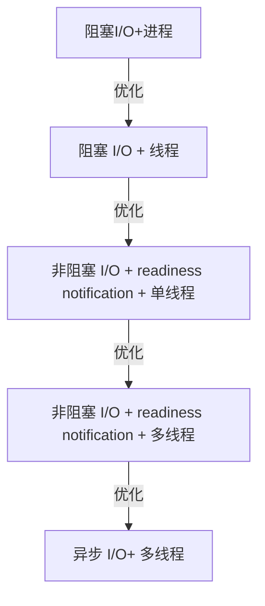

# socket

socket 运行原理图：


三次握手：


* 客户端的协议栈向服务器端发送了 SYN 包，并告诉服务器端当前发送序列号 j，客户端进入 SYNC_SENT 状态；
* 服务器端的协议栈收到这个包之后，和客户端进行 ACK 应答，应答的值为 j+1，表示对 SYN 包 j 的确认，同时服务器也发送一个 SYN 包，告诉客户端当前我的发送序列号为 k，服务器端进入 SYNC_RCVD 状态；
* 客户端协议栈收到 ACK 之后，使得应用程序从 connect 调用返回，表示客户端到服务器端的单向连接建立成功，客户端的状态为 ESTABLISHED，同时客户端协议栈也会对服务器端的 SYN 包进行应答，应答数据为 k+1；
* 应答包到达服务器端后，服务器端协议栈使得 accept 阻塞调用返回，这个时候服务器端到客户端的单向连接也建立成功，服务器端也进入 ESTABLISHED 状态。

三次握手的必要性：

* 建立可靠的双端通信，第一次和第二次握手建立了客户端到服务端可靠的通信，第二次和第三次握手建立了从服务端到客户端的可靠通信。
* 第三次握手是为了防止已失效的请求报文有传送到服务器。客户端发起连接请求，但是因为网络原因服务端没收到，客户端再次发送请求并成功建立了连接，此时之前失效的请求又传送到了服务端，服务端看作一次新的连接进行二次握手确认，因为没有第三握手此时连接成功建立，但是这个连接请求对于客户端来说已经是失效的，所以不会传数据。

socket读取和发送的具体流程：

调用write函数时实际上就是把数据从应用程序中拷贝到操作系统内核的发送缓冲区，操作系统会不断的从发送缓冲区取数据发送出去，如果此时缓冲区的大小无法容纳写入的数据，那么程序会阻塞直到缓冲区可以容纳下写入的数据。

TCP/UDP 即使在本地地址通信，也要走系统网络协议栈，而本地套接字，严格意义上说提供了一种单主机跨进程间调用的手段，减少了协议栈实现的复杂度，效率比 TCP/UDP 套接字都要高许多。

四次挥手：


原因：

* 确保服务端能正常收到确认报文
* 确保网络中的延迟报文消失

socket关闭的不同方式：


tcp keep-alive保活机制

服务器重启可能会出现地址已绑定的情况，这主要是time_wait状态导致的，我们可以设置socket属性：SO_REUSEADDR配置socket可重用。

多数连接处于time_wait的解决方法：自行google

TCP故障分为两大类：

* 一类是对端无 FIN 包，需要通过巡检或超时来发现；
* 另一类是对端有 FIN 包发出，需要通过增强 read 或 write 操作的异常处理，帮助我们发现此类异常。

# 网络工具

ping：基于ICMP协议实现

ifconfig：显示网卡列表

netstat：会把所有 IPv4 形态的 TCP，IPV6 形态的 TCP、UDP 以及 UNIX 域的套接字都显示出来

lsof ：常见用途之一是帮助我们找出在指定的 IP 地址或者端口上打开套接字的进程

tcpdump：抓包工具

# I/O多路复用

* selct：监听的文件描述符的个数是有限的，Linux系统中默认最大值为1024
* poll：监听的文件描述符个数增加（通过链式结构）
* epoll：通过内存映射减少内核和用户态之间的拷贝，通过红黑树组织文件描述符，不用每次都遍历所有的文件描述符

# 非阻塞I/O


# C10K问题的解决思路 



阻塞I/O+进程：


阻塞 I/O + 线程：


事件驱动I/O：（进一步优化可以将reactor多线程化，将连接建立和读写事件处理分开）


# I/O模型

* 阻塞I/O


* 非阻塞I/O（轮询）


* 非阻塞I/O（基于事件的多路复用）


* 异步I/O


buffer设计：


# 进程间的通信方式（IPC）

* 管道

管道一般分为有名管道和无名管道，管道之间的读写是阻塞的，写管道会一直阻塞知道有进城读管道，管道的读写都是一次性的。无名管道和普通的文件不同，它不存在于真实的文件系统中，就相当于一块共享内存。有名管道是一种特殊的文件类型

无名管道只适用于父子进程，父进程创建一个无名管道（pipe）然后fork子进程，子进程会继承父进程对应的文件描述符得到同一个管道的读写文件描述符。

有名管道（fifo）因为会给创建的管道提供标识符，所以不受限于父子进程之间。

```cmd
mkfifo pipe
echo xxxxxxxxxxxxxx > pipe
cat pipe
```

* 共享内存

进程申请一块内存并将自己的虚拟内存空间和这块内存相绑定。任何进程对共享内存中数据的修改应该立即同步到共享内存（有点类似volitile），java内存映射。

* 信号量
* 套接字

# 线程间的通信

* 锁机制
* 信号量
* wait/notify
* volitile（共享内存）